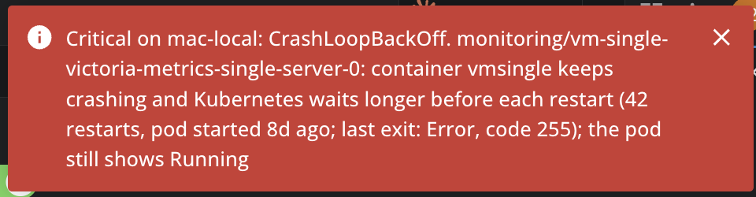
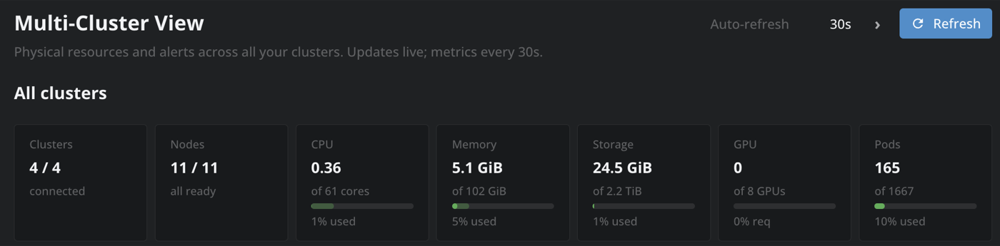
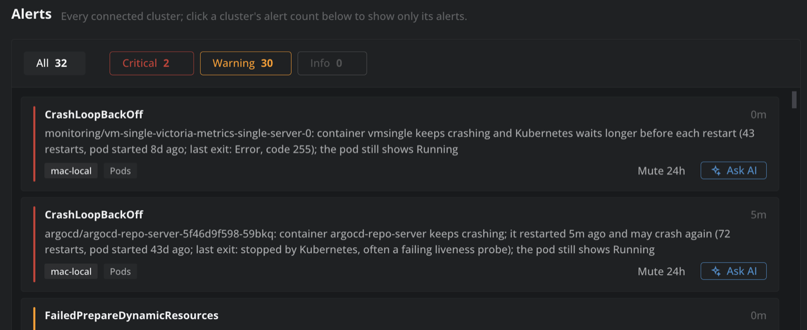
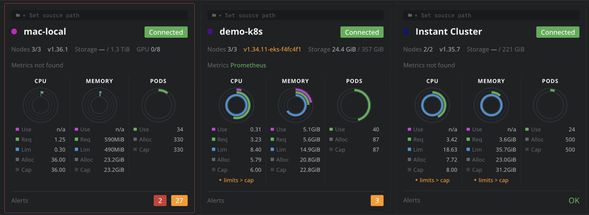
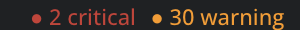

# Multi-Cluster View

One view of all your clusters in Lens: the physical resources and the alerts of every cluster you have, on one tab, and a count of what is wrong in the status bar wherever you are in Lens.

When something breaks, it tells you, and lets you act on it from right there:

## Open it

From the dashboard button in the top bar, the **Multi-Cluster View** item in the navigator, **Multi-Cluster View: Open** in the command palette, or by clicking its alert count in the status bar.

While the view is open it keeps every cluster it lists connected: a cluster Lens finds later, such as one discovered in your Azure account, connects as soon as it appears, and one that is down is tried again, less often each time it fails (up to every 10 minutes). A cluster you disconnect yourself stays disconnected until you press **Connect**.

## All clusters

Clusters connected, nodes ready, and CPU, memory, node storage, GPUs and pod slots summed across all of them, each as used / allocatable with the share requested.

Allocatable and requests come from the nodes and pods of each cluster, watched live. Real CPU, memory and root-filesystem usage come from Prometheus (node-exporter, with cAdvisor as a fallback) at every refresh: every 30 seconds by default, or 1, 2, 5 or 10 minutes, set with the arrows of **Auto-refresh** next to **Refresh**.

## Alerts

One panel for all connected clusters, most severe first:

- **Pods**: containers in CrashLoopBackOff, which stay listed between two crashes instead of coming and going, and say when the pod still shows Running; containers restarting often; image pull and configuration errors; recent OOM kills; pods pending over 10 minutes, with the scheduler's reason.
- **Workloads**: Deployments and StatefulSets short of replicas for over 10 minutes, DaemonSets with unavailable pods, Jobs that failed in the last day, volume claims that never got a volume.
- **Nodes**: NotReady, memory, disk or PID pressure, network unavailable, cordoned.
- **Prometheus**: alerts that are firing (`ALERTS{alertstate="firing"}`), with the severity their rules give them, when the cluster has a Prometheus Lens can reach.
- **Events**: Kubernetes Warning events, grouped per object and reason.

A critical issue, as it reaches you: a container that keeps crashing, with what it last exited with and a note when the pod still shows Running, and what you can do about it from right there.

Filter by severity (All, Critical, Warning, Info) or by one cluster (click its alert count on its card). Click an alert to go to its pod, node, workload or namespace.

- **Ask AI** takes you to the affected resource and starts a troubleshooting conversation on that cluster, briefed with the alert, where to start looking and the logs to read first, including those of the run that crashed.
- **Mute 24h** hides an alert you already know about, from the counts, the status bar and the notifications; **Muted** shows them again, each with **Unmute**.

## Capacity per cluster

One card per cluster: where it comes from (a path you set with **+ Set source path**; Lens does not tell extensions a cluster's kubeconfig or folder), its status, Kubernetes version (in warning colour when it is two minor versions or more behind your newest cluster), nodes, storage, metrics source, CPU / memory / pod rings as in Lens's cluster overview, and its alert count.

**Find a cluster** filters the cards by name; **Sort by Health** puts the clusters with critical alerts first and the disconnected ones last, **Name** sorts them alphabetically.

Click a cluster's name or its rings to open its Lens overview. This goes through the Lens CLI (`lens clusters connect <name> --open`), so it needs **Install Lens CLI** turned on in Lens Preferences; without it, or when two clusters share a name, it opens the cluster's nodes.

## Status bar and notifications

The status bar shows the critical and warning alerts of your connected clusters, or **All clusters OK**, wherever you are in Lens. It only watches clusters that are already connected: connecting them is the view's to do.

A critical alert that appears while Lens is open raises a notification, a few at most at once. What a cluster already had when it connected, and muted alerts, do not. From the notification:

- **Open** goes to what the alert is about, **Ask AI** troubleshoots it.
- **Mute 24h** mutes that alert for a day.
- **Mute all 24h** pauses every notification for a day; **Never notify me** turns them off.

Paused or off, the alerts still show in the view and the status bar, which adds 🔕. **Notifications: On · Pause 24h · Off** at the top of the view shows which it is and turns them back on. What fires during a pause does not all arrive at once when it ends.
